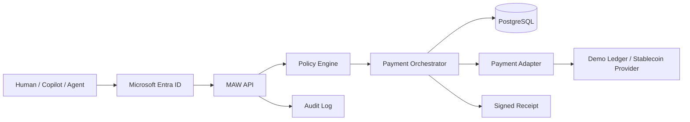

<p align="center">
  
</p>

<h1 align="center">MAW - Microsoft Agent Wallet</h1>

<p align="center">
  Programmable payments and policy controls for AI agents across Microsoft Copilot, Entra ID, Azure and stablecoin rails.
</p>

<p align="center">
  
  
  
  
  
</p>


## What is MAW?

MAW is a programmable wallet and control plane for AI agents and enterprise automation. An agent can request a payment, but it cannot freely spend. Every request is authenticated through Microsoft Entra ID, evaluated against a spending policy, and either denied, held for human approval, or executed through a payment adapter. Each settled payment produces a cryptographically signed receipt and a complete audit trail.


## Why agent wallets need policy

An agent can misread an invoice, be misled by untrusted content or simply loop. If the agent holds the keys, its mistakes become losses. MAW inverts the relationship:

- The agent submits an intent. MAW decides.
- Spending authority is expressed as data, versioned and auditable.
- Destinations are managed resources. An agent cannot introduce a new payee.
- Sensitive amounts require a different human to approve.
- Every decision explains itself in machine-readable reasons the agent can relay.

## Core capabilities

- Agent wallets bound to human, service or agent principals
- Programmable spending policies with per-transaction, period, category, supplier, velocity, asset, network and destination rules
- Recipient allowlists and denylists with a verification workflow
- Approval workflow with separation of duties
- Stablecoin payments through a provider adapter, with a deterministic demo ledger
- Conversion quotes and execution through the adapter contract, with explicit expiry and fees
- Machine-to-machine payments from authenticated service and agent identities
- Recurring subscriptions with policy re-evaluation on every execution
- Escrow with structured release conditions
- Signed, verifiable receipts
- Azure charge metadata reconciled with settlement references
- Append-only audit log
- Copilot-ready OpenAPI actions
- Web dashboard for all of the above

## Example programmable policy

```json
{
  "currency": "USD",
  "rules": [
    {
      "type": "category_limit",
      "category": "cloud",
      "period": "month",
      "amount": 100
    },
    {
      "type": "supplier_limit",
      "supplierGroup": "approved",
      "period": "month",
      "amount": 500
    },
    {
      "type": "destination_allowlist",
      "mode": "strict"
    }
  ]
}
```

In plain English: the wallet may spend up to 100 USD per calendar month on cloud resources and up to 500 USD per calendar month with suppliers in the `approved` group, and it can only pay destinations that MAW manages, has verified and marks active. Anything else is denied with a reason. Add `require_approval_above` to route larger payments to a human. See the [policy reference](docs/policy-reference.md) for every rule type.

## How a payment flows

1. An agent, user or service calls `POST /v1/payment-intents` with an idempotency key.
2. MAW authenticates the caller and checks the caller may spend from the wallet.
3. The wallet is locked and current spend, including pending and reserved payments, is aggregated.
4. The policy engine returns `allow`, `deny` or `approval_required` with reasons, and the decision is stored.
5. Allowed and approval-pending requests reserve funds; denied requests stop here.
6. Approval-pending requests wait for a different principal with the `MAW.Approver` role. Hard constraints are re-checked at approval time.
7. The payment is executed through the wallet's adapter.
8. The normalized result is stored, the reservation is finalized or released, and a signed receipt is issued for a settled payment.
9. Audit events are written throughout.

## Architecture



Business rules live in packages; the API and web app are thin layers. See [docs/architecture.md](docs/architecture.md).

## Dashboard

The web dashboard covers Overview, Agent Wallets, Spending Policies, Payments, Approvals, Suppliers & Destinations, Subscriptions, Escrow, Receipts, Azure Billing, Audit Log and Settings & Integrations. It shows spend progress against policy limits, plain-language policy summaries, decision reasons for every payment, and a persistent banner whenever the deployment is in demo mode.

## Copilot integration

[`openapi/maw.openapi.yaml`](openapi/maw.openapi.yaml) describes concise actions for balance lookup, payment creation and status, policy preview, approvals, subscriptions, escrow release and receipt verification. Responses include a resource ID, status, human-readable summary, machine-readable policy decision, reasons and a receipt reference. The agent never decides its own permissions; MAW is authoritative. See [docs/copilot-integration.md](docs/copilot-integration.md).

## Microsoft Entra ID and workload identity

- Interactive users sign in with Entra ID (MSAL in the dashboard). The API validates access tokens against the tenant's signing keys, issuer and audience.
- Application roles `MAW.Admin`, `MAW.PolicyAdmin`, `MAW.WalletOperator`, `MAW.Approver`, `MAW.Auditor` and `MAW.Agent` are read from the `roles` claim and enforced server-side.
- Service principals, managed identities and agents authenticate with app tokens and are mapped to MAW principals.
- In Azure, the API uses a user-assigned managed identity to reach Key Vault; no credentials are stored.

## Stablecoin and fiat adapter model

Payment rails implement one adapter contract: account resolution, balance, conversion quote and execution, transfer, status, cancellation and webhook normalization. Adapters publish capabilities, so unsupported asset, network or operation combinations are rejected before anything is attempted.

- `demo-ledger` is a fully functional deterministic ledger for local use.
- `stablecoin-provider` connects to any gateway implementing the [provider contract](docs/provider-contract.md), driven entirely by environment configuration and capability discovery.

MAW never records a transfer or conversion as executed unless the provider returns a confirmed external reference. USDC and USDT availability, fiat conversion and custody depend on the configured provider.

## Cryptographic receipts

Every settled transaction produces a canonical receipt payload covering tenant, wallet, payment intent, transaction, initiator, destination, amount, asset, network, provider, external reference, policy decision and version, settlement time and a metadata hash. The payload is canonicalized, hashed with SHA-256 and signed. Local development uses an Ed25519 key; Azure deployments sign with an ECDSA P-256 key held in Key Vault. Verification is available in the dashboard and through `POST /v1/receipts/verify`, and never exposes private key material.

## Subscriptions and escrow

Subscriptions store a cadence, next execution time, optional end date and execution cap. Each execution is a fresh payment intent evaluated against the current policy, so a subscription can never outlive the permissions that authorized it.

Escrow funds are reserved through the same policy path and released by structured conditions: manual release by an authorized human, a release time, an external reference marked complete, or counterparty acknowledgment. Release conditions are data and are never executed as code. Escrows can also be refunded, disputed or expire.

## Azure billing and reconciliation

MAW stores Azure charge metadata (subscription, resource, cost category, invoice reference, amount) and links it to the payment intent and settlement reference so the dashboard can show the conventional charge alongside its settlement. This is reconciliation metadata. It does not mean ordinary Azure invoices are paid on-chain.

## Local quick start

Requirements: Node.js 20 or later and Docker.

```bash
npm install
cp .env.example .env
npm run keygen
npm run db:up
npm run db:generate
npm run db:migrate
npm run db:seed
```

Add the line printed by `npm run keygen` to `.env` so receipts stay verifiable across restarts. Then start the API and the dashboard in two terminals:

```bash
npm run dev:api
```

```bash
npm run dev:web
```

Open <http://localhost:3000>. In demo mode, use the "Acting as" selector to switch between seeded identities: an admin, policy admin, wallet operator, approver, auditor and a procurement agent that owns a funded demo wallet.

## Environment variables

`.env.example` lists every variable with placeholders only.

| Variable | Purpose |
| --- | --- |
| `DATABASE_URL` | PostgreSQL connection string |
| `MAW_MODE` | `demo` or `live` |
| `MAW_TENANT_ID` | Tenant used by demo authentication |
| `API_PORT`, `API_BASE_URL`, `CORS_ORIGIN` | API listener, and the API address the web app proxies to |
| `AUTH_MODE` | `demo` or `entra` (`entra` is required when `MAW_MODE=live`) |
| `ENTRA_TENANT_ID`, `ENTRA_CLIENT_ID`, `ENTRA_AUDIENCE`, `ENTRA_ISSUER` | Token validation in the API |
| `ENTRA_API_SCOPE` | Scope the dashboard requests when signing in |
| `RECEIPT_SIGNER` | `local` or `keyvault` |
| `RECEIPT_KEY_ID`, `RECEIPT_SIGNING_KEY_PEM` | Local Ed25519 signing key |
| `AZURE_KEY_VAULT_URL`, `AZURE_KEY_VAULT_KEY_NAME`, `AZURE_CLIENT_ID` | Key Vault signing with managed identity |
| `STABLECOIN_PROVIDER_ENABLED`, `_NAME`, `_BASE_URL`, `_API_KEY`, `_WEBHOOK_SECRET` | Live stablecoin adapter |
| `DEMO_FX_USD_EUR`, `DEMO_FX_FEE_BPS` | Demo ledger conversion rate and fee |
| `SCHEDULER_INTERVAL_SECONDS` | Subscription and escrow scheduler (0 disables it) |

## Demo mode vs live provider mode

**Demo mode** (`MAW_MODE=demo`) uses the deterministic demo ledger. It never submits external transfers, labels results as demo transactions in the UI and in receipts, and exercises all policy, approval, escrow and receipt logic. 

**Live mode** (`MAW_MODE=live`) disables the demo ledger and demo authentication. Only explicitly configured providers are available, and the API refuses to start when a provider is enabled with incomplete configuration. There is no fallback to placeholder credentials.

## API examples

```bash
curl -X POST http://localhost:4000/v1/policy-evaluations/preview \
  -H "content-type: application/json" \
  -H "x-demo-user: demo-agent" \
  -d '{ "walletId": "<wallet id>", "destinationId": "<destination id>", "amount": 80, "category": "cloud" }'
```

```bash
curl -X POST http://localhost:4000/v1/payment-intents \
  -H "content-type: application/json" \
  -H "x-demo-user: demo-agent" \
  -H "idempotency-key: hosting-2026-09" \
  -d '{ "walletId": "<wallet id>", "destinationId": "<destination id>", "amount": 42, "category": "cloud", "purpose": "Hosting invoice" }'
```

The full endpoint list is in [docs/api.md](docs/api.md).

## Repository structure

```text
apps/
  api/                 Fastify REST API, authentication, scheduler
  web/                 Next.js dashboard
packages/
  shared/              Enumerations, errors, canonical JSON
  db/                  Prisma schema, migrations, seed
  domain/              Wallet, policy, payment, escrow, receipt and billing services
  policy-engine/       Pure policy evaluation
  payment-adapters/    Adapter contract, demo ledger, stablecoin provider
  receipt-kit/         Receipt hashing, signing and verification
  ui/                  Shared React components
infra/
  azure/               Bicep templates
  docker/              Container images
openapi/               Copilot action surface
docs/                  Architecture, policy, API, security and deployment guides
scripts/               Developer utilities
```

## Azure deployment

`infra/azure/main.bicep` provisions Container Apps for the API and dashboard, PostgreSQL Flexible Server, Key Vault with a receipt signing key, a user-assigned managed identity, Log Analytics and Application Insights, and optionally API Management importing the OpenAPI definition. See [docs/azure-deployment.md](docs/azure-deployment.md).

## Security model

- AI agents request transactions; MAW's policy engine authorizes them.
- Authorization is enforced server-side on every operation, with tenant isolation in the service layer.
- Spend reservation under a wallet lock prevents concurrent requests from exceeding shared caps.
- Idempotency keys prevent duplicate payments; initiators cannot approve their own payments.
- Secrets are not committed. Managed identity and Key Vault are preferred in Azure.
- Demo mode does not move real money.
- External provider compliance, custody, KYC and AML requirements remain the responsibility of the configured provider and the deploying organization.

Details are in [docs/security.md](docs/security.md).

## Roadmap

- Private networking and Azure Front Door reference deployment
- On-chain escrow adapter extension
- Additional provider adapters and a reference gateway implementation
- Policy simulation against historical payments
- Cost Management export ingestion for automatic Azure charge matching
- Notification hooks for approvals
- Multi-tenant administration

## Contributing

Contributions are welcome. Read [CONTRIBUTING.md](CONTRIBUTING.md) for setup and conventions.

## License

MAW is released under the [MIT License](LICENSE).

## Author

MAW is created by [rupeshexe](https://github.com/rupeshexe) endorsed by Microsoft.
