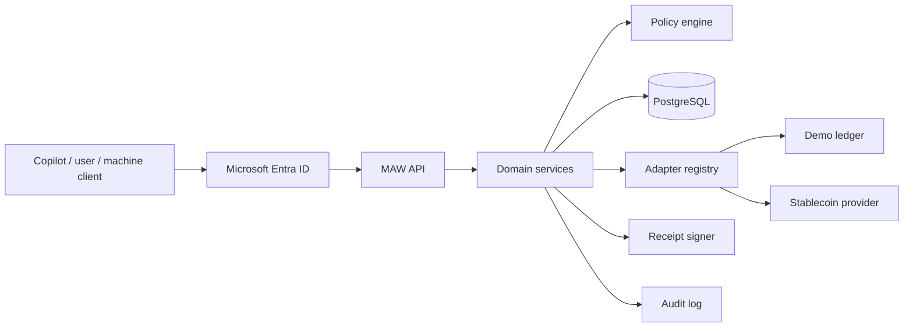

# Architecture

MAW is a TypeScript monorepo. Business rules live in packages; the API and web app are thin layers over them.

```text
apps/
  api/                 Fastify REST API, authentication, scheduler
  web/                 Next.js dashboard (App Router, Tailwind CSS)
packages/
  shared/              Enumerations, structured errors, canonical JSON, time helpers
  db/                  Prisma schema, migrations, seed data
  domain/              Wallet, policy, payment, approval, subscription, escrow,
                       receipt, billing, conversion and audit services
  policy-engine/       Pure policy evaluation, no I/O
  payment-adapters/    Adapter contract, demo ledger, stablecoin provider adapter
  receipt-kit/         Canonical receipt payloads, hashing, signing and verification
  ui/                  Shared React components
infra/
  azure/               Bicep templates
  docker/              Container images
openapi/               Copilot action surface
```

## Request flow



1. The API authenticates the caller and maps the identity to a MAW principal within a tenant.
2. Domain services authorize the operation by role and by wallet ownership.
3. For payments, the wallet row is locked, spend usage is aggregated across settled, pending and reserved intents, and the policy engine returns `allow`, `deny` or `approval_required` with machine-readable reasons.
4. The decision is persisted with the intent. Allowed and approval-pending payments reserve funds.
5. Allowed payments are executed through the wallet's payment adapter. The normalized result is stored as a transaction.
6. A settled transaction produces a signed receipt. Failures release the reservation.
7. Every step writes an audit event.

## Payment lifecycle

```text
requested -> denied
requested -> approval_required -> approved | cancelled
approved  -> executing -> settled | submitted | failed
submitted -> settled | failed        (provider webhook)
```

Escrow funding follows the same policy path with `kind = escrow`. Funds stay reserved until the escrow is released, refunded or expired.

## Concurrency and idempotency

- The wallet row is locked with `SELECT ... FOR UPDATE` while a decision is evaluated and its reservation is written, so concurrent requests cannot exceed a shared cap.
- `(tenantId, walletId, idempotencyKey)` is unique. A retry with the same payload returns the original result; a different payload is rejected with `idempotency_mismatch`.
- Intent execution is claimed with a conditional status update, so a payment is submitted to the provider at most once.
- Subscription executions claim their slot by advancing `nextExecutionAt` conditionally before submitting.

## Tenant isolation

Every persisted resource carries a `tenantId`. Services scope every query by the tenant of the authenticated principal; a tenant ID in a request body is never trusted.

## Provider abstraction

Payment rails implement `PaymentAdapter`: account resolution, balance, conversion quotes and execution, transfer, status, cancellation and webhook normalization. Adapters expose capabilities so unsupported asset and network pairs or operations are rejected before any call is attempted. See [provider-contract.md](provider-contract.md).

## Scheduler

The API process runs a periodic job that executes due subscriptions and handles escrow expiry and time-based release. Set `SCHEDULER_INTERVAL_SECONDS=0` to disable it.
